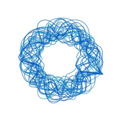
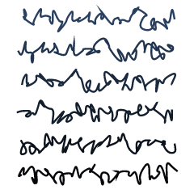
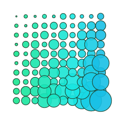
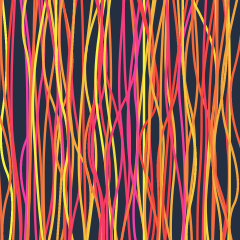
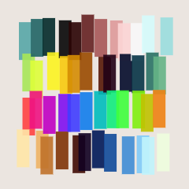

# Solandra

## Principles

Opinionated, agile (code is easy to change) framework for algorithmic art. See my [essays](https://www.amimetic.co.uk/art/) for research/plans that went into this!

- Leverage TypeScript: you shouldn't need to learn much, autocomplete and type checking should have your back.
- Not for beginners.
- Control flow at level of drawing (tiling, partitions etc).
- Few dependencies/mostly from scratch.
- Performance is not the goal.
- Common algorithmic art things (e.g. randomness) should be easy.
- Should feel fun/powerful.
- Life is too short to compile things.
- Rethink APIs e.g. standard bezier curve APIs make absolutely no sense
- Declarative when possible (especially anything configuration-y), procedural when pragmatic; make it easy to explore/change your mind.


## Get Started

- On CodeSandbox, quickly get started: [Simple editable sketch](https://codesandbox.io/s/simple-solandra-example-2-wy7nx?fontsize=14)
- Clone [this project](https://github.com/jamesporter/solandra) to try out as add React powered GUI around stuff but first see: [Live Demo](https://solandra.netlify.com/).
- On [NPM](https://www.npmjs.com/package/solandra). Install with `npm i solandra` or `yarn add solandra`.

Or if you want to play locally clone this repo, install dependencies with `npm` or `yarn` and start by:

```
yarn dev
```

or

```
npm run dev
```

Then open [http://localhost:3000](http://localhost:3000) and in your editor `sketches.ts` and try things out. It does things like the below


```typescript
p.forTiling({ n: 20, margin: 0.1, type: "square" }, ([x, y], [dX, dY]) => {
  p.lineStyle = { cap: "round" };
  p.proportionately([
    [
      1,
      () => {
        p.setStrokeColour(120 + x * 120, 90 - 20 * y, 40);
        p.drawLine([x, y], [x + dX, y + dY]);
      },
    ],
    [
      2,
      () => {
        p.setStrokeColour(120 + x * 120, 90 - 20 * y, 40);
        p.drawLine([x + dX, y], [x, y + dY]);
      },
    ],
  ]);
});
```











## The Website

This website is built using [Docusaurus](https://docusaurus.io/), a modern static website generator.

### Installation/Run

```
$ yarn
$ yarn start
```

This command starts a local development server and opens up a browser window. Most changes are reflected live without having to restart the server.

### Build

```
$ yarn build
```

This command generates static content into the `build` directory and can be served using any static contents hosting service.
