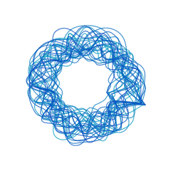
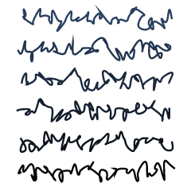
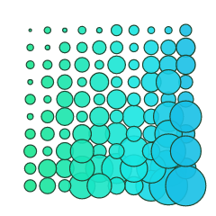
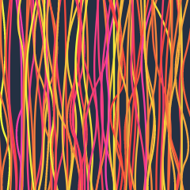
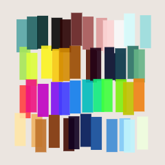

# Solandra

## Principles

Opinionated, agile (code is easy to change) framework for algorithmic art. See my [essays](https://www.amimetic.co.uk/art/) for research/plans that went into this!

- Sketches always have width 1, height depends on aspect ratio.
- Angles in radians.
- Points are [number, number].
- Colours in hsl(a).
- Leverage TypeScript: you shouldn't need to learn much, autocomplete and type checking should have your back.
- Not for beginners.
- Control flow at level of drawing (tiling, partitions etc).
- Few dependencies/mostly from scratch.
- Performance is not the goal.
- Common algorithmic art things (e.g. randomness) should be easy.
- Should feel fun/powerful.
- Life is too short to compile things.
- Rethink APIs e.g. standard bezier curve APIs make absolutely no sense
- Declarative when possible (especially anything configuration-y), procedural when pragmatic; make it easy to explore/change your mind.


## Get Started

- On CodeSandbox, quickly get started: [Simple editable sketch](https://codesandbox.io/s/simple-solandra-example-2-wy7nx?fontsize=14)
- Clone [this project](https://github.com/jamesporter/solandra) to try out as add React powered GUI around stuff but first see it [live](https://solandra.amimetic.co.uk/).
- On [NPM](https://www.npmjs.com/package/solandra). Install with `pnpm add solandra`, `npm i solandra` or `yarn add solandra`.

Or if you want to play locally clone this repo, install dependencies with `pnpm i` and start by:

```
pnpm dev
```

Then open [http://localhost:3000](http://localhost:3000) and in your editor `sketches.ts` and try things out. It does things like the below


```typescript
p.forTiling({ n: 20, margin: 0.1, type: "square" }, ([x, y], [dX, dY]) => {
  p.lineStyle = { cap: "round" }
  p.proportionately([
    [
      1,
      () => {
        p.setStrokeColour(120 + x * 120, 90 - 20 * y, 40)
        p.drawLine([x, y], [x + dX, y + dY])
      },
    ],
    [
      2,
      () => {
        p.setStrokeColour(120 + x * 120, 90 - 20 * y, 40)
        p.drawLine([x + dX, y], [x, y + dY])
      },
    ],
  ])
})
```









[Over 140 Examples](./samples/samples.md)



## Use with AI

There is a lot more graphics code out there which uses verbose, tedious APIs. To leverage LLMs with Solandra you will want to tell them about how Solandra works. You can copy and paste [llm.md](./llm.md) into your projects and markdown slash/custom command files. For example with e.g. Claude Code the following approach should work well for a 'daily sketches' project, providing a new slash command `new-sketch`.

Create a new file like `.claude/commands/new-sketch.md`

````md
---
description: Create a new sketch
---

- Identify the largest numbered sketch like src/sketches/sketch-N.tsx
- Create a new file src/sketches/sketch-N+1.tsx by incrementing N (but do pad with up to 2 zeros)

Should look like this initially, but replace the {NUMBER_PADDED} and {DO_SKETCH_HERE} parts:

```tsx
import { Circle, type SCanvas } from "solandra"
import { Canvas } from "../components/Canvas"

const sketch = (s: SCanvas) => {
  s.background(20, 20, 30)

  {DO_SKETCH_HERE}
}

const Sketch{NUMBER_PADDED} = () => <Canvas sketch={sketch} />

export default Sketch{NUMBER_PADDED}
```

- do some kind of generative art sketch in the sketch function using the Solandra library
- Add to src/App.tsx
- Add to src/Directory.tsx
- Do not run any checks or formatting, do not run the server; just generated and update files

# Guide on how to use Solandra
````

then add the full contents of [llm.md](./llm.md) to the end.
