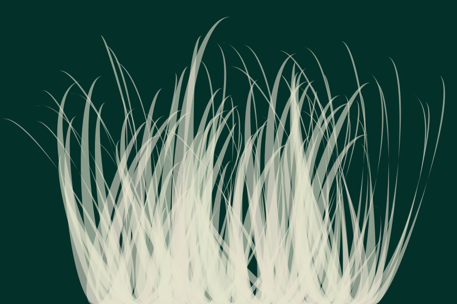
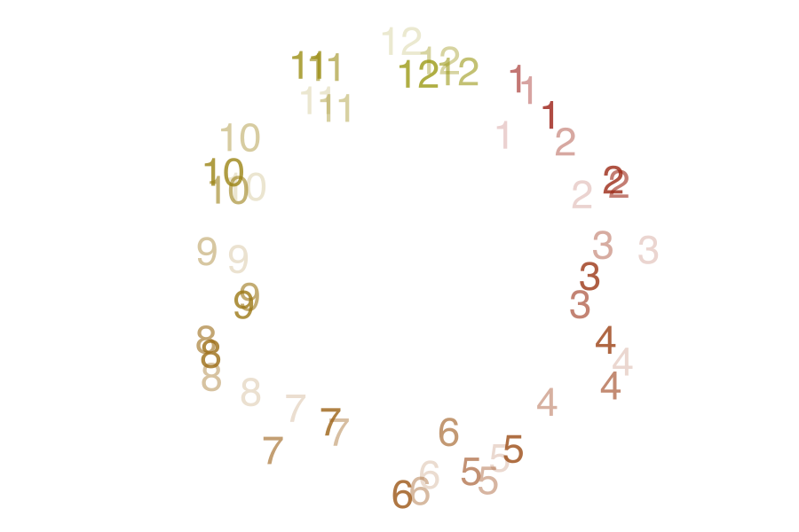
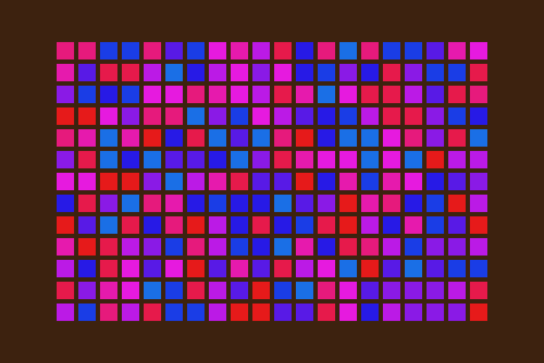
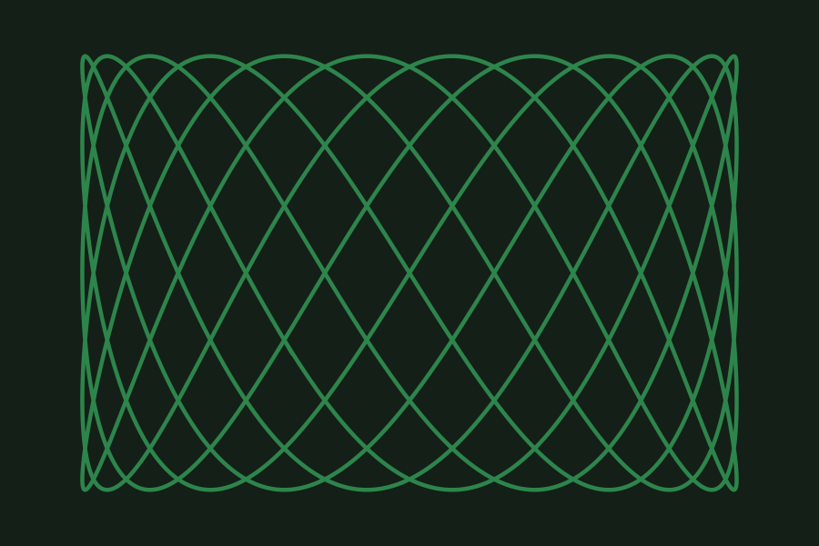

# Sketches

## Highlights

### Tiling

### Chaiken

### Mondrianish

### Script-ish

### Doodles

### Bubbles

### Gaussian

### Poisson

### Curves

### Transforms Demo 2

### Time

### Polygons 2

### Hatching Demo 2

### More Arcs

### Color Wheel

### Sunburst

### Fancy Tiling

### Sketching Curves

### Record Cover

### Record Cover 2

### Paint Strokes

### Round Paint Strokes

### Minis 2

### Contoured 3

### Centrality

### Central Curves

### Line of Curves

### Dividing 1

### Dividing 2

### Dividing 6

### Bokeh

### Advanced Divisions

## API Samples

### Rainbow Drips

### Horizontal

### Vertical

### Curves Demo

### Flower

### Tiled Curves

### Around a Circle

### Arcs

### Noise

### Rectangles Divided

### Hello World

### Circle Labels

### Circles

### Ellipses Demo

### Gradient Demo 1

### Gradient Demo 2

### Gradient Demo 3

### Gradient Demo 4

### Gradient Demo 5

### Gradient Demo 6

### Transforms Demo

### Transforms Demo 3

### Clipping Demo

### Rounded Rectangles Demo

### Cards

### Polygons

### Polygons 3

### Stars

### Hatching Demo 1

### Even More Arcs

### Curls

### Color Palette Generator

### Stack Polygons

### Another Tiling

### Shading In

### Shading Again

### Shaded Arcs

### Arc Chart

### Bars

### Discs

### Colour Themes

### Colour Themes 2

### Colour Themes 3

### Colour Themes 4

### Colour Palettes

## Animated

### Blob

### Lissajous

### Low Resolution

### Low Resolution 2

### Low Resolution 3

## Advanced APIs

### Compound Path

### Compound Path 2

### Transforming Paths

### Ordering of Tiles

### Dashes

### Shadows

### Shadow Animation

### Glow

### Segments

### Hex

### Hex (Horizontal)

### Triangles

## Advanced Paths

### Dividing 3

### Dividing 4

### Dividing 5

### Dividing 7

### Dividing 8

### Dividing 9

### Dividing 10

### Advanced Divisions 2

### Paths to Curves

### Paths to Curves 2

### Spirals

### Spirals 2

## Isometric

### Isometric

### Isometric 2

### Isometric 3

### Isometric 4

### Isometric 5

### Isometric 6

### Isometric Tapes

### Isometric Fragments

### Isometric Cube Examples

### Isometric Rotation

### Lorenz Attractor

## Randomness and Noise

### Noise Field

### Rectangles

### Gaussian 2

### Gaussian 3

### Little Abstracts

### Record Cover 3

### Record Cover 4

### Stacked Curves

### Stacked Curves 2

### Minis

### Weave

### Weave 2

### Explosion

### Contoured

### Contoured 2

### Night

### Noise Glow

### Perturbed Spiral

### Perturbed Spiral 2

### Perturbed Spiral 3

## Text

### Basics

### Positions

### Measure

### Custom Font

